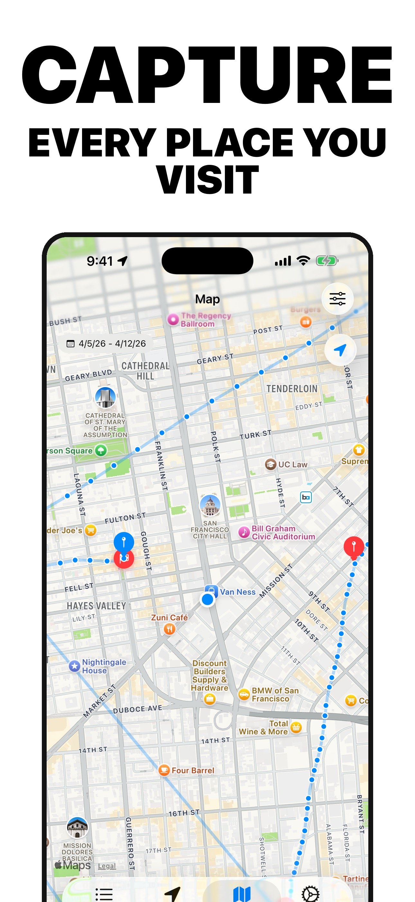
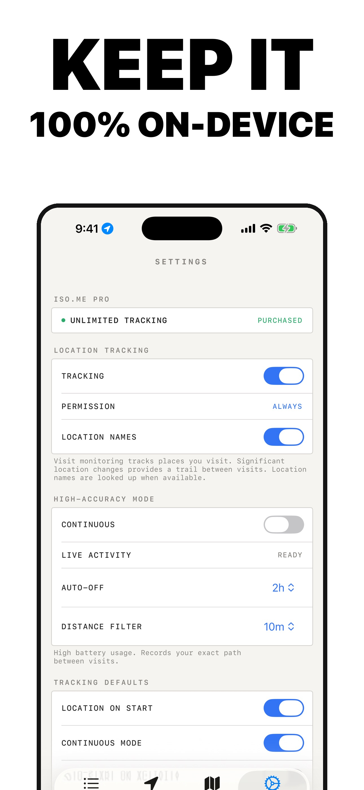
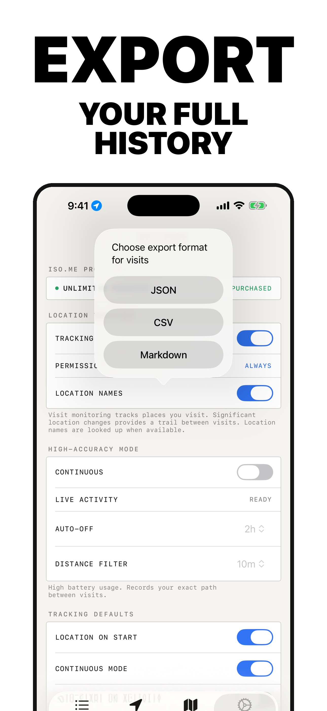

# iso.me

> **Open source, privacy-first iOS location tracking — your data stays on your device.**

[](LICENSE)
[](#tech-stack)
[](#tech-stack)

iso.me is a location tracking app for iOS and watchOS. It automatically records the places you visit throughout the day, tracks routes with continuous GPS logging, and **keeps every byte of your data on-device**. No accounts. No cloud sync. No third-party dependencies. No analytics. Just you, your phone, and your history.

**[🌐 isome.isolated.tech](https://isome.isolated.tech)** · **[📲 Download on the App Store](https://apps.apple.com/app/id6761960794)** · **[🛠 Contribute](CONTRIBUTING.md)** · **[💬 Discussions](https://github.com/CodyBontecou/isome/discussions)** · **[👥 Discord](https://discord.gg/jNRWSSSz4N)** · **[⭐ Star this repo](https://github.com/CodyBontecou/isome)**

## Screenshots

| Capture every visit | Keep it on-device | Export your history |
|---|---|---|
|  |  |  |

## Features

### Visit Detection
Automatic background detection of places you arrive at and depart from, powered by `CLLocationManager` visit monitoring. Each visit is reverse-geocoded to show a human-readable address and location name.

### Continuous Tracking
High-accuracy GPS tracking that records your exact path. Configurable distance filter (5m-200m) and auto-off timer (30 min to never). Tracked points include altitude, speed, and accuracy metadata.

### Auto-Start on Activity
Continuous tracking can start automatically when the app detects you're driving, walking, running, or cycling. Uses CoreMotion's `CMMotionActivityManager` to classify device motion. When enabled:

1. Significant location changes (~500m movement) wake the app in the background
2. CoreMotion is queried for the current activity type
3. If driving or exercising is detected, continuous tracking starts automatically
4. When you become stationary, the auto-started session stops automatically
5. Manually started sessions are never auto-stopped

Enable this in **Settings > Tracking Defaults > Auto-Start on Activity**.

### Live Activities
Real-time tracking status on the lock screen and Dynamic Island. Shows current location, distance traveled, points recorded, and remaining auto-off time.

### Export & Import
Export visits and location points as JSON, CSV, or Markdown. Choose a date range, time-of-day window, and per-format field toggles, and either condense everything into a single file or split the export into **one file per day** for easier downstream slicing. Optionally set a default export folder for one-tap saves and schedule a daily auto-export. Import previously exported data back into the app. Export is the one paid feature — see [Pricing](#pricing).

Exports drop in cleanly to the [iso.me Maps Obsidian plugin](https://github.com/CodyBontecou/obsidian-iso-me-maps), which renders visits, routes, heatmaps, and outliers as Leaflet maps inline in your notes — point a code block at a single condensed export, a folder of per-day files, or a filename glob.

### Watch App
Companion watchOS app showing today's visit count, distance traveled, and tracking status. Syncs with the main app via shared App Groups.

### Widgets
iOS lock screen widget via Live Activities and watchOS complications for quick tracking status.

## Pricing

Tracking is free and unlimited — visits, continuous routes, watch app, Live Activities, widgets. No subscription, no ads, no usage caps.

The one paid feature is **export**: a one-time **$9.99** unlock for JSON, CSV, and Markdown export of your visits and location points. Lifetime, no recurring charge.

The split is on purpose: tracking is the commodity, but a clean, lossless export of your full history is the part that's worth paying for once. It also keeps the privacy promise free at the door — you never have to pay to keep your data on your device.

## Tech Stack

- **Language:** Swift 5
- **UI:** SwiftUI
- **Data:** SwiftData
- **Minimum iOS:** 17.0
- **Minimum watchOS:** 10.0
- **Dependencies:** None (all native Apple frameworks)

### Frameworks Used

| Framework | Purpose |
|-----------|---------|
| CoreLocation | Visit monitoring, GPS tracking, geocoding |
| CoreMotion | Activity detection (driving, walking, cycling) |
| SwiftData | On-device persistence for visits and location points |
| ActivityKit | Live Activities on lock screen and Dynamic Island |
| WidgetKit | Home screen and watch widgets |
| StoreKit 2 | In-app purchase (lifetime unlock) |
| MapKit | Map visualization and route display |
| Combine | Reactive state management |

## Project Structure

```
IsoMe/
  Models/
    Visit.swift                    # Visit data model (coordinates, times, address)
    LocationPoint.swift            # Continuous tracking point model
    LocationActivityAttributes.swift  # Live Activity state
  Services/
    LocationManager.swift          # Core location tracking logic
    ActivityDetectionManager.swift # CoreMotion activity detection
    LiveActivityManager.swift      # Live Activity lifecycle
    GeocodingService.swift         # Reverse geocoding with caching
    StoreManager.swift             # In-app purchase management
    UsageTracker.swift             # Free tier usage tracking
    LogManager.swift               # Crash and debug logging
  ViewModels/
    LocationViewModel.swift        # Data coordination between UI and services
  Views/
    ContentView.swift              # Root view with onboarding and tab navigation
    TrackingView.swift             # Tracking controls
    MapView.swift                  # Map with visit pins
    SessionPathMapView.swift       # Route path visualization
    SettingsView.swift             # Preferences, export, import, data management
    VisitDetailView.swift          # Individual visit details
    PaywallView.swift              # Pro upgrade screen
    LogViewerView.swift            # Debug log viewer
  Utilities/
    ExportService.swift            # JSON/CSV/Markdown export
    ImportService.swift            # Data import parsing
    ExportFolderManager.swift      # Default export folder management
    DistanceFormatter.swift        # Metric/imperial formatting
    TEDesign.swift                 # Design tokens and typography
  IsoMeApp.swift                   # App entry point
  AppDelegate.swift                # Background launch handling

IsoMeWidget/                       # iOS widget and Live Activity extension
IsoMeWatch/                        # watchOS companion app
IsoMeWatchWidget/                  # watchOS widget extension
Shared/                            # Shared code (App Group data sync)
```

## Build Targets

| Target | Bundle ID | Platform |
|--------|-----------|----------|
| IsoMe | `com.bontecou.isome` | iOS |
| IsoMeWidgetExtension | `com.bontecou.isome.Widget` | iOS |
| IsoMeWatch | `com.bontecou.isome.watchkitapp` | watchOS |
| IsoMeWatchWidgetExtension | `com.bontecou.isome.watchkitapp.Widget` | watchOS |

## Setup

1. Open `IsoMe.xcodeproj` in Xcode 15+
2. Select the **IsoMe** scheme
3. Set your development team for all four targets
4. Configure the App Group entitlement (`group.com.bontecou.isome`) for your team
5. Build and run on a physical device (location features require real hardware)

### Required Permissions

The app requests the following permissions at runtime:

- **Location (Always)** - Background visit detection and tracking
- **Location (When in Use)** - Foreground location display
- **Motion & Fitness** - Activity detection for auto-start feature

### Entitlements

- App Groups (`group.com.bontecou.isome`) - Shared data between app, widgets, and watch
- Background Modes: Location updates
- Live Activities support

## URL Scheme

The app registers the `isome://` URL scheme. Currently supports:

- `isome://stop` - Stops continuous tracking (used by Live Activity)

## Contributing

Contributions are welcome — bug reports, feature ideas, and pull requests. See [CONTRIBUTING.md](CONTRIBUTING.md) for the full setup guide (Xcode, signing, TestFlight) and a list of [good first issues](https://github.com/CodyBontecou/isome/issues?q=is%3Aissue+is%3Aopen+label%3A%22good+first+issue%22).

If you want to chat about the project, design decisions, or what to build next, jump into [GitHub Discussions](https://github.com/CodyBontecou/isome/discussions).

## License

iso.me is licensed under the [GNU Affero General Public License v3.0](LICENSE). The AGPL ensures that any modified version of iso.me — including ones run as a hosted service — must also be open source. This protects the privacy-first promise: nobody can take iso.me, bolt on tracking, and ship it as a closed product.
